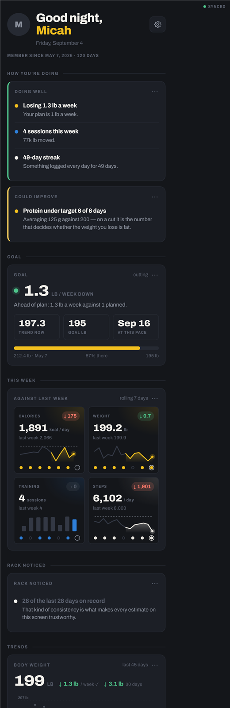
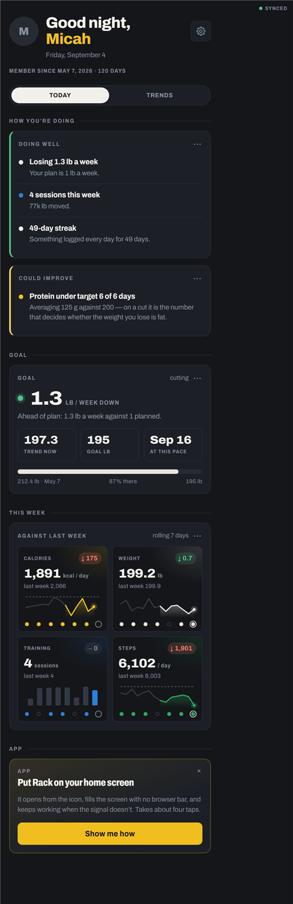

# Overnight improvement pass — report

Run unattended on the night of 3–4 September 2026 against the tag
`before-improvements` (`cfb1101`). Four phases, four deploys: the live site
moved `rack-v24 → v25 → v26 → v27 → v28`, one bump per completed phase. Every
numbered item is one commit. Nothing under `worker/`, `database.rules.json` or
the access model was touched, and no schema was migrated.

Verification: no test suite exists, so a headless harness was built in the
session scratchpad and reused before every deploy — a tiny static server, a mock
`store.js` swapped in by an import map, four months of realistic generated data
(exercise names taken from `exercises.js`, weigh-ins twice a day, four sessions a
week, food, water and steps), and Edge headless rendering all five tabs plus the
main sheets at 390 px and 320 px. Every run checked for console throws, blank
views and (from Phase 2) silent SVGs, and drove synthetic pointer events, writes
and sheet actions where an item needed behaviour proved rather than looked at.
`node --check --input-type=module` ran over every module before every commit.
The harness lives in the scratchpad, not the repo, as asked.

---

## 1. Every item

| Item | Status | Commit | Note |
|---|---|---|---|
| 1a "Last 7 days" undercounts across a month boundary | DONE | `6e9168f` | `fetchMonth()` split from `loadMonth()` so the live watch stays on the calendar's month; both months fetched at init and lazily if the tab is alive when the month turns. On Sep 4 the card went from 4 groups to all 6. |
| 1b Blank-weight sets vanish at Finish | DONE | `c4e352d` | Kept as `w: '0'`. Verified: pull-ups saved as 0×8, blank-reps set dropped, volume counts only loaded sets, no false PR. |
| 1c Weight tab flashes blank | DONE | `ba9652a` | Synchronous paint, placeholder maintenance card, `fillTDEE()` guarded by a render sequence. |
| 1d Weight rate colour assumes a cut | DONE | `b966644` | `goalDir(targets, maintCal)` now in `tdee.js`; `you.js`, `weight.js` and (found) `food.js goalSign` all read it. |
| 1e Weigh-in time chips | DONE | `23b7d00` | Now / This morning / Custom. "This morning" is the median clock time of the account's own pre-11am weigh-ins, clamped to now. Verified stamps: custom → Thu 07:15 local. |
| 1f Self-host Archivo | DONE | `c4be96f` | Three woff2 subsets in `fonts/`, `@font-face` in `rack.css` and `404.html`, preload in `index.html`, latin file + `index.html` precached by the worker. Verified: with `fonts.googleapis.com` and `fonts.gstatic.com` resolved to NOTFOUND the render is pixel-identical. |
| 1g Service worker network timeout | DONE | `0cec24b` | 3 s race when a cached copy exists, background refresh via `waitUntil`. 18-check node harness over the worker (fast / slow / dead / 404 / pass-through / install with dead network / version message). |
| 2a Judgement tokens | DONE | `b8b125a` | `--ok #4ec38a`, `--caution #ffcf5c`, `--miss #ff7a6b`; every `--good/--warn/--bad` use and every spelled-out rgba tint migrated. |
| 2b One colour per subject | DONE | `cea1da2` | `--s-fuel/--s-train/--s-steps/--s-weight/--s-water` tokens; Weight chrome, Steps green everywhere, Water a blue tint. |
| 2c `--dim-text` | DONE | `f44a9d7` | `#83899a`. 75 text/fill uses in `rack.css` and 8 in `auth.css` migrated; one hairline and the JS swatch fallbacks keep `--dim`. Ratios in §2. |
| 2d Chart aria | DONE | `822d3a4` | `role="img"` + generated label on lineChart, barChart, ring, sparkline, donut, heatStrip and the Steps tab's local heat map. Zero silent `.chart` SVGs across five screens. |
| 2e Bar labels every kth | DONE | `a079c25` | `k = ceil(n/8)` counted from the newest bar. |
| 2f `minSpan` | DONE | `3a5366a` | lineChart and sparkline; 4 lb from the Weight chart, You's weight card and You's weight tile. Verified with a flat 40-day series. |
| 2g Split bar on Statistics | DONE | `b6bb48e` | Shared `splitBar()` in `analytics.js`, used by `stats.js` and `you.js`; `admin.js` donut untouched. |
| 2h `markMax` default off; shared ring in Steps | DONE | `d7db5ef` | Exercise-detail charts opt in; `steps.js` private `ring()` deleted. |
| 3a Scrub-to-read | DONE | `303326e` | `attachScrub()` in `analytics.js`. Verified with synthetic touch: drag reads, vertical drag is left to the scroll, tap reads, second tap hides. |
| 3b You split Today / Trends | DONE | `dbf3ab0` | `segmented()` under the hero, remembered in LS `youView`. Nothing removed. |
| 3c Goal line on the Weight chart | DONE | `76e026f` | lineChart `refs`; "Goal 195 lb · 2.3 lb to go" under the stats. |
| 3d Water strip under the Fuel summary | DONE | `68ce6b9` | `renderWaterStrip()`; + logs the default preset through the same `addWater()`. |
| 3e Tap the Fuel title for today | DONE | `b308580` | Dotted underline, `role=button`, keyboard. |
| 3f Dock labels sentence case 11 px | DONE | `4531fe2` | Kept after the 320 px comparison — see §2. |
| 3g Pinch zoom, dock `aria-hidden`, manifest shortcuts | DONE | `b991268` | Shortcuts land on `#go=food-add`, `#go=workout-start`, `#go=weight`, handled once in `restoreView()`. |
| 4a Quick log | DONE | `0aa2705` | Calories-only entry, `src: 'quick'`, `daySummaries.q`; You and `insights.js` keep such days for calories and leave them out of the macro rows and protein verdicts, and say so. |
| 4b Recent foods row | DONE | `d53e8a1` | Last ten distinct names from the last fortnight; one tap logs a `repeat`. |
| 4c Copy a meal or day forward | DONE | `3d539b5` | Per-meal "to today", whole-day button, "copy yesterday's" on an empty meal today. |
| 4d Export | DONE | `3970224` | JSON of everything + five CSVs; `saveText()` tries the share sheet on touch, then a download, then the copy sheet. |
| 4e About row | DONE | `dd95033` | App build, worker build (asked over `postMessage`), last sync, queued writes, connection, installed. |
| 4f Default rest on the account | DONE with a deviation | `cebd7f0` | Written to **`settings/train.restSec`, not `profile`** — see §2. |
| Docs | DONE | `6cf7a0d` | `AGENTS.md`: `src 'quick'`, `daySummaries.q`, `settings/train`. |
| Phase bumps | — | `b0d6bb4` `4f6f56b` `e93bd96` `60f0ead` | v25, v26, v27, v28. |

Nothing was skipped or reverted.

---

## 2. Judgment calls

**2a — the hues.** Kept the starting values. On the graphite the mint card
border, the coral delta pills and the lemon caution read as verdicts and no
longer match any plate; none of the three read plastic against the plates on
the same screen, so nothing was darkened. Contrast as text on `--bar #1c1f26`:
`--ok` 7.46:1, `--caution` 11.26:1, `--miss` 6.48:1. The old `--bad` (plate red)
was 3.27:1 as text and failed AA everywhere it was used. The rgba tints that had
the judgement hexes spelled out (done-set wash, delta pills, trajectory dots,
admin flags) moved with the tokens; tints that are genuinely plates (set types,
Fuel zones, selection highlights) were left alone.

| | before | after 2a |
|---|---|---|
| You tab |  |  |

**2b — Weight in chrome.** `--s-weight` is `--p-white`. The fitted trend that
You draws over the daily average had been chalk, which vanished into a white
line, so it moved to `--p-chrome`, dashed. Water needed a hue nobody else uses
so it could sit beside Train on You: `--s-water #62a9f0` is the one subject
colour that is not a plate (6.6:1 on `--bar`).

**2c — the number.** The suggested `#7d838f` is 4.33:1 on `--bar`, under AA.
Chosen `#83899a`: 4.72:1 on `--bar`, 5.18:1 on `--rack`, 4.11:1 on `--collar`,
still visibly quieter than `--steel` (5.35:1). For the record: `--dim #5c6270`
is 2.70 / 2.96 / 2.35 on the same three surfaces.

**2h — the Steps ring lost its second arc.** The private ring drew a yellow
overshoot arc past 100%; the shared ring closes at 100% by design. The caption
under the number ("143% of 10k") carries the overshoot now.

**3a — how the readout behaves.** It is drawn in SVG (a rounded box and up to
four lines) on the side away from the finger, with one decimal below 1,000. A
mouse hovers; on touch the readout stays after the finger lifts and goes away on
the next tap of the same spot. `touch-action: pan-y` on the chart means a
vertical drag never reaches the handler at all.

**3b — what is on both pages.** The hero and the App section (install card,
Admin row) stay on both Today and Trends so the owner's Admin row is always one
tap away.

**3f — the dock labels.** Kept. At 320 px the capitals with `.09em` tracking
were cramped; sentence case at 11 px reads as words and still has room.

| 320 px before | 320 px after |
|---|---|
|  |  |

**3g — shortcuts vs a live workout.** A shortcut to Fuel or Weight is honoured
even with a session in progress (the session is safe in localStorage);
`startFresh()` never replaces a live session, it lands on it.

**4a — zero macros, not missing keys.** Quick entries write `p/c/f` as `0`
plus `src: 'quick'`, rather than omitting the keys, so every `e.p || 0` path
and the ×2 chips stay safe. Honesty lives in `src` and `daySummaries.q`: a day
with any quick calories stays in every calorie average and is excluded from the
macro averages and protein verdicts, with the notes saying how many days were
left out. Stricter than pro-rating, and simpler to explain. `bump()` records a
quick log as `foodManual` because the usage vocabulary is closed and validated
by the published rules.

**4d — getting the file off the device.** On a touch device the share sheet is
tried first (iOS ignores `download` in home-screen mode), then an anchor
download, then the existing copy sheet.

**4f — not on `profile`.** The published rules end `profile` with
`"$other": { ".validate": false }`, so adding `restSec` there would fail the
*whole* profile write silently. `settings` has no validation block, so the
value lives at `settings/train.restSec` — additive, no rules change, same
intent. The rest timer still reads localStorage; `workout.js` copies the
account's value into it at boot.

Final state of the You tab (Today page):



---

## 3. Found, not listed

- `food.js goalSign()` was a third private copy of the goal-direction rule
  (fixed as part of 1d).
- `sw.js` had no precache at all: offline-first-launch only worked for files
  that happened to have been fetched, and the navigation fallback keyed on
  `./index.html` while a browser tab usually fetched the directory URL (fixed
  in 1f).
- Statistics drew "Sessions per week" in plate green — the last Train chart in
  a plate hue (fixed in 2g).
- The Statistics "Volume per week" chart prints a value over every bar and at
  14 bars those still overprint each other ("64.1k66.3k67.5k"). 2e thinned the
  axis labels only, as asked. **Not fixed.** Thinning the value labels the same
  way, or dropping them above 8 bars, is a two-line change in `barChart`.
- `profile` cannot take new keys without a rules change (see 4f).
- Harness quirk, not a bug: after midnight the mock's "today" has no food,
  because meals are only generated up to the current hour.

---

## 4. Less confident — look here first

1. **1e on iOS Safari.** The Custom chip is a `datetime-local` input styled
   inline. It renders as Safari's native picker; check it is tappable and reads
   right in the installed app.
2. **1g on a real weak signal.** The race is node-tested against stubbed
   `fetch` and `caches`, not on a phone. The behaviour to expect: with a cached
   copy the shell appears within ~3 s on bad signal; a first visit still waits
   for the network.
3. **3a on iOS.** Synthetic pointer events proved the logic; the real feel of
   the 8 px decision threshold and `pan-y` against Safari's own scroll is worth
   a minute on the Weight chart. If it fights scrolling, raise the threshold in
   `attachScrub()`.
4. **4d on iOS.** Only the desktop download branch ran in the harness. On the
   phone the share sheet should open with a file; if `navigator.canShare` says
   no, it falls through to a download, then to the copy sheet.
5. **4e on the phone.** The harness has no service worker, so the About sheet
   showed "not running". Installed, it should show `rack-v28` for both rows.
6. **4a's exclusion rule** is deliberately strict — one quick entry excludes
   the whole day from the macro rows. If people quick-log a snack most days,
   the macro rows will be over fewer days than the calorie average; the note
   says so, but it may feel too strict.
7. **4b cost.** Opening the log sheet reads 14 day nodes (mirror-cached when
   offline, 14 small gets when online). Fine at this scale; trim `days` in
   `recentEntries()` if it ever shows.
8. **4f offline.** A rest change made offline updates localStorage but the
   `mergeUpdate` to the account is not queued; it catches up at the next change.
9. **2b's `--s-water`** is the one subject colour that is not an IPF plate.
10. **The CSV code path** in `settings.js` was byte-patched after a scripting
    slip turned `\r\n` into real line breaks; it syntax-checks and the harness
    verified quoting and row counts, but it is the one piece of code that did
    not arrive in one clean edit.

---

## 5. Web Push — assessment only, nothing built

**Permissions flow.** `Notification.requestPermission()` has to come from a
user gesture, and on iOS it only exists for an app installed to the Home
Screen (iOS 16.4+). So: a settings row ("Remind me to log"), a sentence about
what it does, then the prompt — never at boot. A denied prompt is permanent on
iOS until the user digs into Settings, so the sheet should say what it will
send before asking.

**VAPID keys.** One keypair, generated once (`npx web-push generate-vapid-keys`).
The public key ships in the app as `applicationServerKey`; the private key goes
into Cloudflare's encrypted secret store beside the Anthropic key
(`wrangler secret put VAPID_PRIVATE_KEY`) and never into the repo.

**Storing subscriptions.** Three options, and only one fits the current trust
model:

- A new `users/{uid}/push/{deviceId}` node needs a per-section write grant and
  validation in the rules — and the Worker, which has no Firebase credentials
  by design, could not read it to send.
- A public-by-key node like `aiAllow/{uid}` would let the Worker read it, but a
  push endpoint is a capability URL: anyone who reads it can send to that phone.
  Not acceptable.
- **The client registers its subscription with the Worker directly**, POSTing
  `{ endpoint, keys, tz }` with the Firebase ID token the estimator already
  sends; the Worker verifies the token and stores it in KV under `push:{uid}`.
  No database change, no rules change, no new credentials, and the existing
  per-account pattern covers it. This is the one to build.

**Worker cron.** `[triggers] crons = ["0 * * * *"]` in `worker/wrangler.toml`
and a `scheduled` handler that walks `push:*` in KV, picks the devices whose
local evening it is (the `tz` offset stored with the subscription), and sends.
Deciding *whether* to nudge ("nothing logged today") is the hard part: the
Worker cannot read `users/{uid}/food`, so either the client tells the Worker
"logged today" on each log (one extra fetch, `logged:{uid}:{date}` in KV) or the
reminder is unconditional at a chosen hour. Sending is the Web Push protocol —
a VAPID JWT (ES256) and an `aes128gcm`-encrypted payload — both doable with
WebCrypto in a Worker in a couple of hundred lines, or with a small library;
prune a subscription on 404/410. In the app, `sw.js` gains `push` →
`showNotification` and `notificationclick` → open `#go=food-add`, which 3g
already routes.

**What breaks for anyone not installed.** In an iOS Safari tab
`registration.pushManager` does not exist, so nothing can subscribe; the
settings row must detect that and send them to the existing install guide.
Android Chrome works in a tab or installed; desktop works. Rough size: a day for
the Worker (subscribe endpoint, KV, cron, signing and encryption), half a day
for the client.

---

## 6. Reverting

Each phase is a contiguous range of commits ending in its version bump.
Revert in reverse order — later phases build on earlier ones (Phase 3 and 4
CSS use the Phase 2 tokens) and reverting an early phase alone will conflict.
After any revert, bump `CACHE` in `sw.js` and `VERSION` in `usage.js` before
pushing, or phones keep the build they have.

```powershell
# Phase 4 (v28): quick log, recent row, copy forward, export, about, rest on the account
git revert --no-edit e93bd96..60f0ead

# Phase 3 (v27): scrub, You split, goal line, water strip, title tap, dock labels, shortcuts
git revert --no-edit 4f6f56b..e93bd96

# Phase 2 (v26): tokens, subject colours, dim-text, aria, bar labels, minSpan, split bar, ring
git revert --no-edit b0d6bb4..4f6f56b

# Phase 1 (v25): the seven bugs, fonts, service worker
git revert --no-edit before-improvements..b0d6bb4

# Everything at once, keeping history
git revert --no-edit before-improvements..HEAD

# Everything at once, discarding history (only if nobody else has pulled)
git reset --hard before-improvements && git push --force
```
